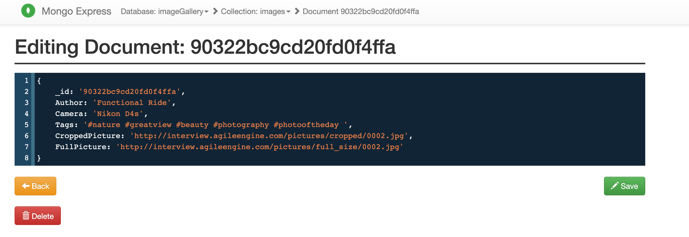
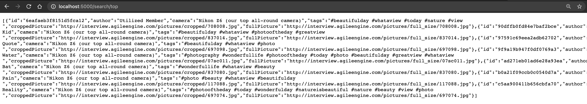
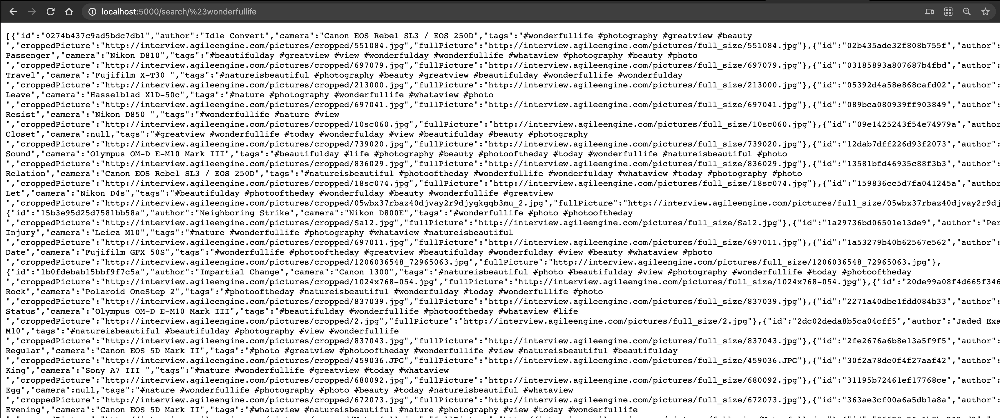
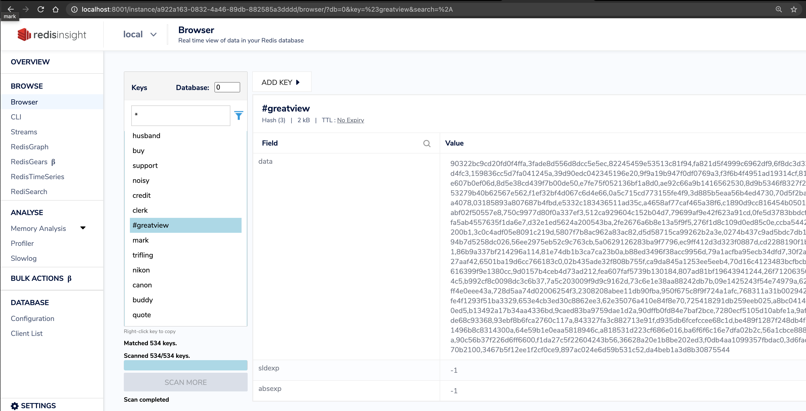

# AgileEngine

### Run `Image gallery Search`

Needed software
- [x] `docker` & `docker-compose`
- [x] `browser`

Steps  

* Open folder `AE.ImageGallery`
* Run command `docker-compose build --no-cache`
* Run command `docker-compose up -d`
* Check search results for `#wonderfullife` => `http://localhost:5000/search/%23wonderfullife`
* Check search results for `top` => `http://localhost:5000/search/top`

Information  
* Search with symbols like `#` etc - should be UrlEncoded.
* Terms parser works only by words => doesn't respect whitespaces as `Utilized Member`
* Terms parser doesn't reload content by timer =>  is skipped to reduce time.
* The process of saving images to the local storage => is skipped to reduce time. (+1 repository and url)
* Tests, tests and again tests => is skipped to reduce time. 
  * You could check tests as for example in `ImageGalleryClientTests`
* Parser very simple, but it resolves the current load. With new incoming requirements it could be improved.

Help tools
- [x] Redis viewer: https://redislabs.com/redis-enterprise/redis-insight/  
- [x] Mongo viewer: http://localhost:8081/  

Screens

